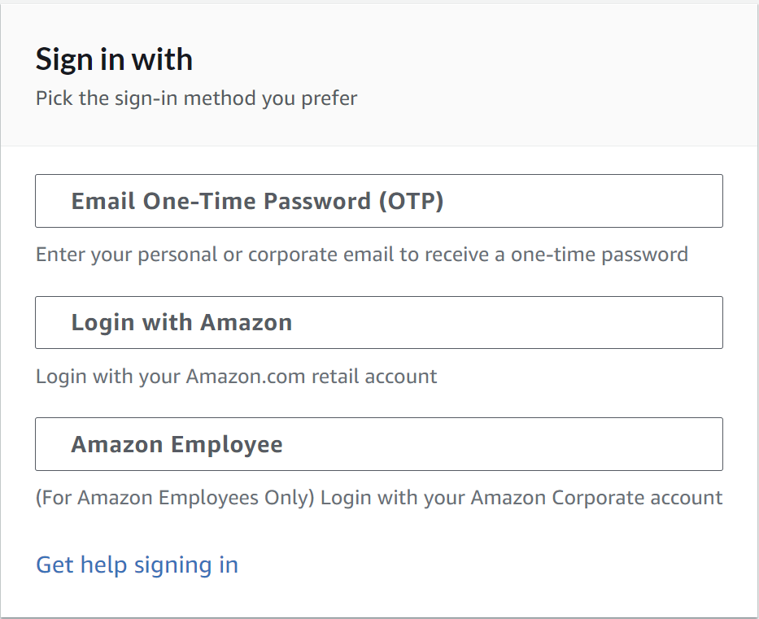
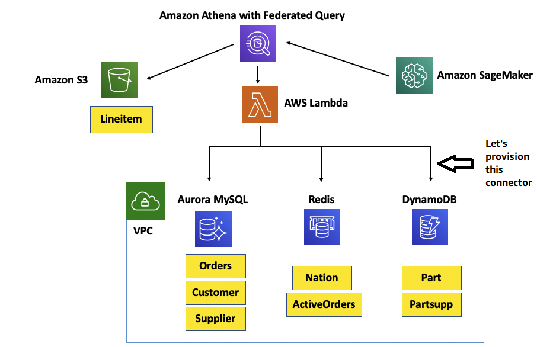
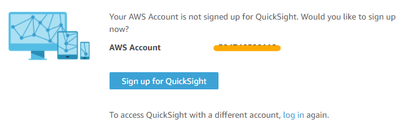
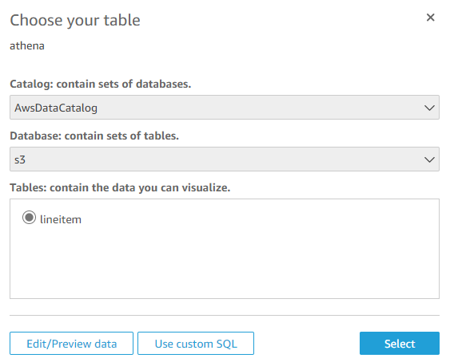
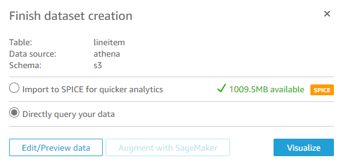

# Welcome to Cloud Guild - April 2021!

## Getting Started
You have been provided with an AWS Account to run this workshop. 

1. Browse to https://dashboard.eventengine.run/ and enter your participant hash key to login to your AWS account:
   
    

2. Click **Email One-Time Password (OTP)** to receive your one-time password. You can use your personal or corporate email:
   
   

3. Enter your email and click **Send passcode**:
   
   

4. Enter your passcode and click **Sign in**
   
   

5. Now click on **AWS Console** to log into the AWS Console:
   
   

6. In the pop-up window, click **Open AWS Console**, the Console will open in a new browser tab:
   
    

7. In the Console, make sure you're in the N. Virginia (us-east-1) AWS Region - the region selector is in the top right corner:
   
   

Congrats, you're in!

## Your AWS Environment
During the briefing you would've been introduced to [Amazon Athena](https://aws.amazon.com/athena/?whats-new-cards.sort-by=item.additionalFields.postDateTime&whats-new-cards.sort-order=desc) - a serverless, interactive query service to query and analyze big data on S3 using standard SQL.

Today we will focus on [Athena Federated Query](https://aws.amazon.com/blogs/big-data/query-any-data-source-with-amazon-athenas-new-federated-query/). This feature of Athena enables data analysts, engineers, and data scientists to execute SQL queries across data stored in relational, non-relational, object, and custom data sources, such as API.

To demonstrate Athena federation capabilities, we will use the [TPCH dataset](http://www.tpc.org/tpch/), often used in decision support benchmarks. The queries and the data populating the database have been chosen to have broad industry-wide relevance. This benchmark illustrates decision support systems that examine large volumes of data, execute queries with a high degree of complexity, and give answers to critical business questions. The components of TPC-H consist of eight separate and individual tables (the Base Tables). The relationships between columns in these tables are illustrated in the following diagram:


In this workshop, we're dealing with a hypothetical e-commerce platform that consists of microservices with each microservice using a purpose-built managed AWS database engine. There's also a legacy part of the application that outputs regular extracts to S3. Here's how the tables are spread across AWS services:

* [Amazon S3](https://aws.amazon.com/s3/) holds extracts of `LINEITEMS` from a legacy system 
* [Amazon ElastiCache for Redis](https://aws.amazon.com/elasticache/redis/) is used to store countries (`NATIONS`) and active orders (`ACTIVEORDERS`) so that the processing engine can get fast access to them
* [Amazon Aurora MySQL](https://aws.amazon.com/rds/aurora/) is used for processing `ORDERS`, `CUSTOMER` and `SUPPLIER` data
* [Amazon DynamoDB](https://aws.amazon.com/dynamodb/) holds the Parts (`PART`) and Parts/Supplier Relationship (`PARTSUPP`) tables for high performance



To save time, we have preconfigured Athena Federated query to work with S3, Aurora and Redis, but not to DynamoDB, which we are going to configure now.

## Installing Athena DynamoDB Connector

To install Athena DynamoDB Connector, search for **Serverless Application Repository** in your AWS account seach bar at the top of the Console and click on "Available applications" ([link](https://console.aws.amazon.com/serverlessrepo/home?region=us-east-1#/available-applications)):


Make sure to tick **Show apps that create custom IAM roles or resource policies** and search for **AthenaDynamoDBConnector** and click on the one published by the AWS verified author:


To complete installation of Athena DynamoDB Connector, we need to populate a few application settings (bottom right part of the screen):

**Application name**: Leave it as default name - `AthenaDynamoDBConnector`

**SpillBucket**: Put `athena-federation-workshop-<AWS_ACCOUNT_NUMBER>`

> For example, `athena-federation-workshop-285462502417`
> 
> Your AWS account number is a unique 12-digit sequence that can be found in the top right corner of the AWS Console, copy it without the dashes. 

**AthenaCatalogName**: Put `dynamo`

**DisableSpillEncryption**: Leave it as default value of `false`

**LambdaMemory**: Leave it as default value of `3008`

**LambdaTimeout**: Leave it as default value of `900`

**SpillPrefix**: Put `athena-spill-dynamo`

Tick **I acknowledge that this app creates custom IAM roles** and click **Deploy**:


The installation process will deploy and configure the Athena DynamoDB connector. Installation will take place in the background in under a minute. 

We now have Athena connectors set up to query all required sources in our e-commerce platform: S3, Aurora, Redis and now also DynamoDB. Let's run some queries!

## Running Athena Federated Queries

1. Go to Athena console: https://console.aws.amazon.com/athena/home?region=us-east-1# and click **Get Started**.

    > Notice the announcement at the top of the screen. No action from you is required as we have upgraded your Athena Workgroup to the new [Athena v2 engine](https://aws.amazon.com/about-aws/whats-new/2020/11/amazon-athena-announces-availability-of-engine-version-2/) that supports Federated Queries. You can close the announcement if you want:
    > 

2. We prepared a few queries for you - click on **Saved Queries** and then click on the saved query named **Sources**:
   
   

3. In the Athena Query Editor you should see queries like this, each selecting a few rows from the 4 sources: S3, Aurora for MySQL, DynamoDB and Redis respectively:
   
    ```sql
   select * from s3.lineitem limit 10;

   select * from "lambda:mysql".sales.supplier limit 10;

   select * from "lambda:dynamo".default.part limit 10;

   select * from "lambda:redis".redis.active_orders limit 5;
    ```

4. We'll use these queries to test Athena Connectors for each of data source before running more complex queries. You need to run one query at a time: highlight the first query and click **Run query**. Once the query executes succesfully you should see the results like this:
   
   
   
    Proceed with highlighting and running the 2nd, 3rd and the 4th query to make sure all Athena connectors are fully operational.

5. Now let's run some more complex queries! Go back to **Saved Queries** and try the following queries:
   
   * `FetchActiveOrderInfo` - to fetch active orders   
   * `ProfitBySupplierNationByYr` - to fetch annual profit by supplier by country
   * `SuppliersWhoKeptOrdersWaiting` - to fetch suppliers ordered by order fulfilment duration
   * `ShippedLineitemsPricingReport` - price/discount report across all orders

## Using Athena with BI Tools

You can use [ODBC and JDBC to access Athena](https://docs.aws.amazon.com/athena/latest/ug/policy-actions.html) using your favourite BI tool or even Excel. 

Let's create a QuickSight account and try it out.

1. In a new browser tab, go to https://quicksight.aws.amazon.com/
2. Click on **Sign up for QuickSight**:
   
   

3. Select **Enterprise edition** and click **Continue**:
   
   

4. Enter the following values:
   
   * **Quicksight account name**: any globally unique name, for example `athena-<YOUR-AWS-ACCOUNT-ID>`
   * **Notification email address**: your work or personal email address
   
5. Click on **Choose S3 buckets** link in the bottom right corner and in the pop-up window tick **Select all** and add **Write permission for Athena Workgroup** to give QuickSight access to S3 buckets in your AWS account. Click **Finish**:
   
   

6. Click **Finish** to complete setting up your QuickSight account:

   

7. After a few seconds your QuickSight account is created. Click **Go to Amazon QuickSight** to proceed:

   

8. Let's create a first report using data from Athena. Click **New analysis** in the top right corner:
   
   

9. Let's register Athena as our first dataset, click **New dataset**:
    
   

9. On the next screen, select **Athena** and in the pop-up window, enter `athena` as **Data source name** and click **Create data source**:
   

9. On the next screen, select `s3` as the **database** and `lineitem` as the **table**. Click **Select**:

   

9. On the next screen, select **Directly query your data** to query Athena directly and click **Visualize**:

   

9. You are presented with a blank canvas - let's drop some columns onto it! QuickSight will adjust the best visualisation based on the data selected:
   * Click `l_quantity`, then click `l_extendedprice` - the visualisation becomes a scatter plot which shows that there are no outliers and the order price increases in line with orded quantity:

      

   * Create a new Sheet in QuickSight:

      

   * Click `l_shipdate`, then click `l_extendedprice` - this gives us a trendline of quantity by date. We can immediately notice the sharp decline in mid 1998 which may be indicative of a data quality issue:

      

   * Click on the `l_shipdate` date dimension and change from days to weeks:

      

   * Now Click **...** in the top right corner of the visualisation and click **Add forecast**:

      

   * QuickSight chooses the best machine learning model and plots the forecasted value:

      
   
   Please note that all of the visualisations you've just generated are using Athena on top of the `s3.lineitems` table which is just a flat file on S3!

   Feel free to stop or play with QuickSight or continue with the bonus task below.

## [Bonus Task] Using Athena for data transformations

1. **BONUS TASK** Athena can also be used for basic EL(T) and writing data to S3. For example, notice that `s3.lineitem` is stored on S3 in a pipe-delimited format, which is inefficient for querying. Run `SHOW CREATE TABLE s3.lineitem;` in a new tab in Athena Query Editor and review the output. Notice that the table is defined as `EXTERNAL` and notice the serialisation format specified by `ROW FORMAT DELIMITED FIELDS TERMINATED BY '|'`.

    Let's run a [`CREATE TABLE AS SELECT` (CTAS) query](https://docs.aws.amazon.com/athena/latest/ug/ctas.html), to create a `PARQUET` version of the `lineitems` table, optimised for analytical queries on S3. In Athena Query Editor, run:

    ```sql
    CREATE TABLE s3.lineitem_parquet
    WITH (
        format = 'Parquet',
        parquet_compression = 'SNAPPY')
    AS SELECT *
    FROM s3.lineitem;
    ```

    `PARQUET` is a columnar format, optimised for analytical queries. Run the following two queries - the first one on pipe-delimited `s3.liteitem` table and the second one - on the `PARQUET`-optimised `s3.lineitem_parquet` table. Highlight and run them separately, and note the difference in the amount of data scanned because of compression and column indexes in `PARQUET`. 

    ```sql
    -- First query
    SELECT AVG(l_discount) AS avg_discount, l_shipmode 
    FROM s3.lineitem
    GROUP BY l_shipmode
    ORDER BY avg_discount DESC;

    -- Second query
    SELECT AVG(l_discount) AS avg_discount, l_shipmode 
    FROM s3.lineitem_parquet
    GROUP BY l_shipmode
    ORDER BY avg_discount DESC;
    ```

    Similarly, you can materialise output of any of the analytical queries you ran earlier using optimised formats, like `PARQUET` or `ORC`. Try this yourself! 

## Additional Materials

Thank you for joining today's session. We hope you found it useful. Should you want to learn more about Athena and other AWS services, check out our AWSome workshops:
* Big Data: https://workshops.aws/categories/Big%20data
* Analytics: https://workshops.aws/categories/Analytics
* Data Lake: https://workshops.aws/categories/Data%20Lake

Please do not hesitate to reach out to Raj and Igor, your AWS Solution Arrchitects, if you have any questions. 

See you next time!

## Acknowledgements

This workshop is based on https://athena-in-action.workshop.aws/

